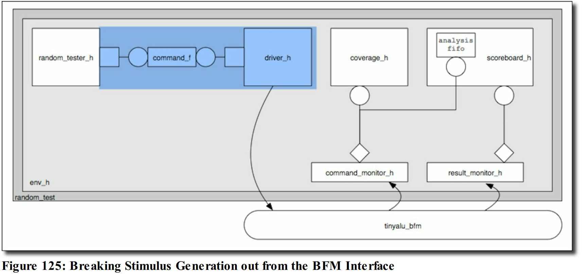

# 18.Put_and_get_Ports_in_Action
В структуру тестбенча добавляется два новых класса: **driver** и **tester**.
Первый является классом, реализующий передачу транзакций в DUT из tester-a, который является генератором "наполнения" транзакции. 



Общаются эти объекты через `uvm_tlm_fifo #(type) variable` и подлкючаются через connection_phase в env_class

```verilog
uvm_tlm_fifo #(command_s) command_f;

function void connect_phase(uvm_phase phase);
    driver_h.command_port.connect(command_f.get_export);
    random_tester_h.command_port.connect(command_f.put_export);
    // соединяем объекты через command_f uvm_tlm_fifo
endfunction : connect_phase
```

Драйвер представляет из себе набор тасок, которые принимают данные в качестве аргумента и отправляют их в DUT.

base_tester наполняет поля данными, которые потом будут переданы в драйвер. Драйвер эти поля оборачивает в физический уровень, отправляю в DUT согласно протоколу.

## 1. base_tester кладет данные в uvm_tlm_fifo:
```verilog
    uvm_put_port #(command_s) command_port;
    
    function void build_phase(uvm_phase phase);
        command_port = new("command_port", this);
    endfunction : build_phase

   task run_phase(uvm_phase phase);
        command_s    command;
      
        phase.raise_objection(this);
        repeat (1000) begin : random_loop
            command.op = get_op();
            command.A =  get_data();
            command.B =  get_data();
            // кладем сформированные данные в put_port через метод put()
            command_port.put(command);
        end : random_loop
        #500;
        phase.drop_objection(this);
   endtask : run_phase
```
## 2. driver отправляет данные из uvm_get_port в DUT
```verilog
   virtual tinyalu_bfm bfm;
   uvm_get_port #(command_s) command_port;
   
   function void build_phase(uvm_phase phase);
      if(!uvm_config_db #(virtual tinyalu_bfm)::get(null, "*","bfm", bfm))
        $fatal("Failed to get BFM");
      command_port = new("command_port",this);
   endfunction : build_phase

   task run_phase(uvm_phase phase);
      command_s    command;
      shortint     result;
      forever begin : command_loop
         command_port.get(command);
         // положить данные из get_port-а во внутреннюю переменную 
         bfm.send_op(command.A, command.B, command.op, result);
         // отправить данные в bfm
      end : command_loop
   endtask : run_phase
```
